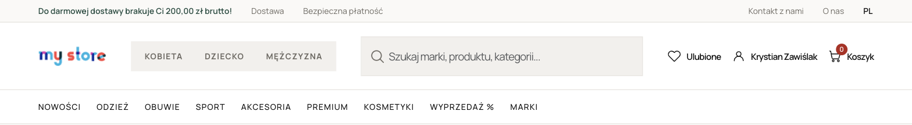
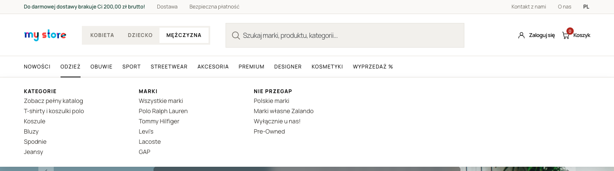
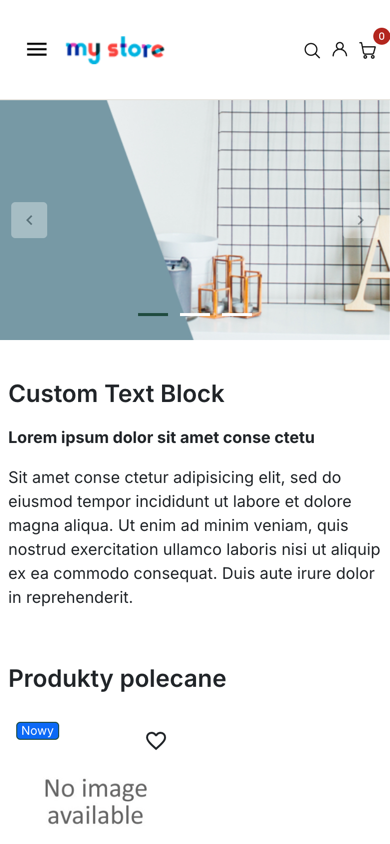
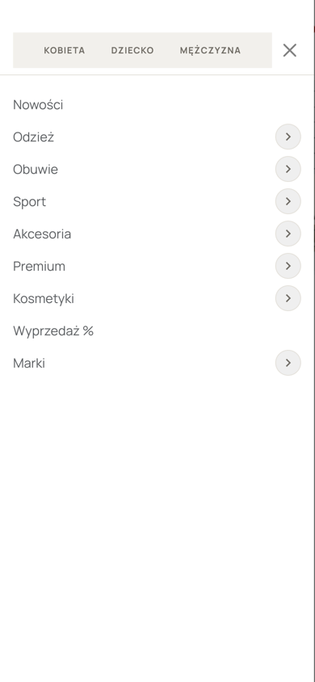
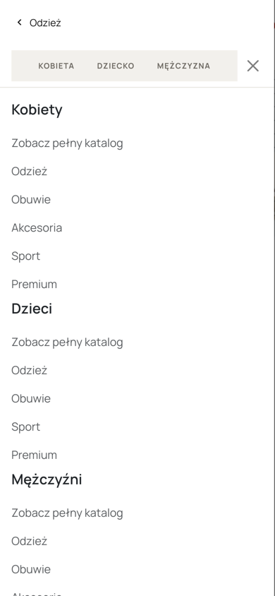

# Design Presta 1

## Status projektu — MVP

To nie jest gotowy sklep — to mockup/design headera (głównie desktop), reszta
to niezmieniony Hummingbird. Szczegóły niżej w `## Header`.

## Uruchomienie od zera

Wymagane: [Docker Desktop](https://www.docker.com/products/docker-desktop/) (lub
Docker Engine z Compose v2), `git`, `openssl`, dostęp do internetu, wolne porty
`1000` i `3307`.

1. Sklonuj repo:

   ```bash
   git clone https://github.com/KrystianZawislak/design-presta-1.git
   cd design-presta-1
   ```

2. Utwórz plik `.env` (nie trafia do gita) z losowymi hasłami do bazy:

   ```bash
   cat > .env <<EOF
   DB_ROOT_PASSWD=$(openssl rand -hex 24)
   DB_PASSWD=$(openssl rand -hex 24)
   ADMIN_MAIL=
   ADMIN_PASSWD=
   EOF
   chmod 600 .env
   ```

   Otwórz `.env` i uzupełnij `ADMIN_MAIL` i `ADMIN_PASSWD` — e-mail i hasło, którymi
   zalogujesz się do panelu admina (silne hasło, min. 8 znaków, bez spacji i `$`).
   Hasła do bazy zostaw wygenerowane: muszą składać się tylko z liter i cyfr, bo
   skrypt instalacyjny obrazu PrestaShop nie obsługuje znaków specjalnych.

3. Uruchom kontenery:

   ```bash
   docker compose up -d
   ```

4. Poczekaj na koniec instalacji (ok. 3–5 minut), śledząc logi:

   ```bash
   docker compose logs -f prestashop
   ```

   Instalacja jest gotowa, gdy pojawi się `Project database imported`, a potem
   `Starting web server now`. `Ctrl+C` zamyka podgląd logów (kontenery działają dalej).

5. Otwórz sklep: http://localhost:1000

6. Adres panelu admina (folder z losową nazwą) wyświetli:

   ```bash
   docker compose logs prestashop | grep backoffice
   ```

   Logujesz się danymi `ADMIN_MAIL` / `ADMIN_PASSWD` z `.env`.

Kolejne uruchomienia: `docker compose up -d`, zatrzymanie: `docker compose stop`.

### Co się dzieje przy pierwszym starcie

Wersje są przypięte (`prestashop/prestashop:9.1.5-8.5`, `mariadb:11.8.9`, oba po
digeście), więc każdy dostaje dokładnie te same pliki PrestaShopa, na których
powstał projekt. Obraz kopiuje czystą Prestę do `prestashop/` przez `cp -n`
(nie nadpisuje plików z repo), instaluje sklep, a potem skrypt
`docker/post-install/import-project.sh` doinstalowuje języki projektu, importuje
`docker/db/prestashop.sql` (moduły, menu, kategorie, marki, konfiguracja) i odtwarza
1:1 pliki z `docker/files/` (obrazki, tłumaczenia, szablony maili) — dzięki temu
wynik nie zależy od tego, co serwer tłumaczeń PrestaShopa serwuje w danym dniu.

Dump nie zawiera kont admina, klientów, zamówień, koszyków, sesji, logów ani
sekretów — konto admina, klucze szyfrujące (`parameters.php`) i nazwa folderu
admina są generowane przy każdej instalacji osobno.

Instalator PrestaShopa pobiera paczki językowe z `i18n.prestashop-project.org` —
jeśli instalacja zatrzyma się na `Cannot download language pack`, zresetuj
instalację i uruchom ponownie:

```bash
docker compose down
rm -rf db_data
git clean -fdX prestashop
docker compose up -d
```

### Aktualizacja bazy i plików w repo

Po zmianach w BO (treści, obrazki, tłumaczenia), które mają trafić do repo, przy
uruchomionych kontenerach:

```bash
./docker/export.sh
```

Skrypt nadpisuje `docker/db/` (dump bez danych osobowych i sekretów, lista języków)
oraz `docker/files/` i `docker/files.list` (migawka `img/`, `translations/`,
`mails/` i szablonów maili modułów).

### Przed produkcją

- Włącz cache w `Parametry zaawansowane → Wydajność` (`PS_CSS_THEME_CACHE`,
  `PS_JS_THEME_CACHE`, `PS_SMARTY_CACHE`) — w dumpie są wyłączone pod development.
- Porty są wystawione tylko na `127.0.0.1`; na serwerze sklep musi stać za
  reverse proxy z HTTPS, a `PS_DOMAIN` w `docker-compose.yml` trzeba przed pierwszą
  instalacją zmienić na docelową domenę.

## Struktura repo

Repo trzyma tylko customizacje (patrz `.gitignore` — reszta `prestashop/` jest
ignorowana): moduły `designassets`, `freeshippingbar`, `megamenu`, wybrane pliki
motywu `hummingbird` (CSS, fonty, `header.tpl`, `ps_customersignin`/
`ps_shoppingcart`/`ps_languageselector`/`ps_searchbar`/`blockwishlist`), override
`override/modules/blockwishlist` (ikonka wishlisty w headerze) oraz `docker/` (dump
bazy, migawka plików i skrypty instalacyjne).

## Header

Custom header (przełącznik Kobieta/Dziecko/Mężczyzna, mega menu, rozwijane menu
w hamburgerze ze scrollem) to **wersja desktopowa** (≥992px):



### Mega menu

Moduł `megamenu` zastępuje standardowe menu Hummingbirda. Każda pozycja menu ma
panel z maksymalnie **5 stałymi slotami na kolumny** — w BO wybiera się, w którym
slocie stoi kolumna, więc puste sloty zostają pustym miejscem zamiast przesuwać
resztę. Kolumna ma tytuł, opcjonalny link zbiorczy (np. „Zobacz pełny katalog”) i listę
linków (kategoria, producent lub własny URL).

Przełącznik Kobieta/Dziecko/Mężczyzna podmienia cały zestaw pozycji menu — każda
kategoria przełącznika ma w BO osobne menu (z opcją skopiowania do innej).
Konfiguracja: `Moduły → Menedżer modułów → Mega Menu → Konfiguruj`.



Linki w kolumnach typu „Nie przegap” prowadzą na razie do `#` — docelowe adresy
trzeba ustawić w BO.

### Mobile (<992px)

Pasek nagłówka to standardowy layout Hummingbirda (hamburger, logo, lupka, konto,
koszyk). Customizacja jest **wewnątrz hamburgera**: przełącznik na górze, pozycje
menu, a po kliknięciu strzałki kolumny danej pozycji (drill-down z przyciskiem
powrotu).

<p>
  
  
  
</p>

## Branche

- `main` — wersja do oddania (squash z `develop`)
- `develop` — bieżąca praca, pełna historia commitów
